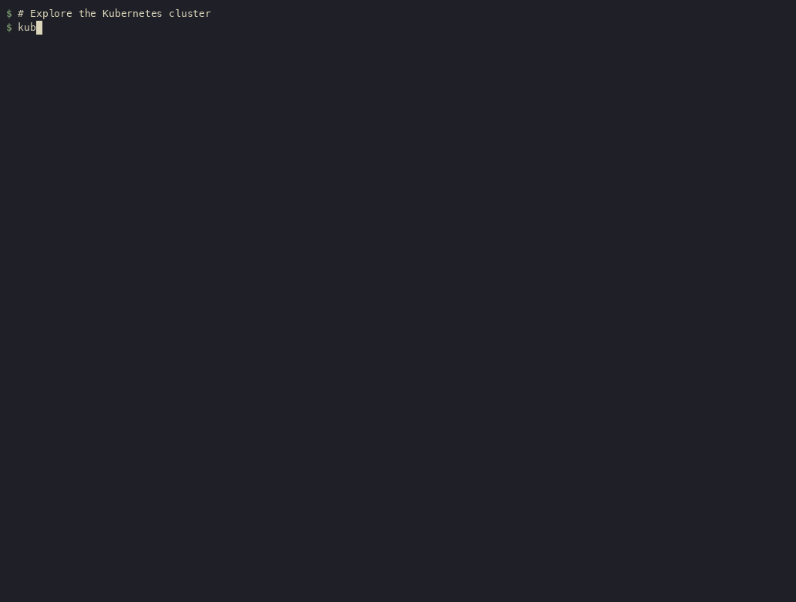

<p align="center"></p>

<h1 align="center">kubectl-rustnet</h1>

<p align="center"><strong>English</strong> | <a href="README.zh-CN.md">简体中文</a> | <a href="README.ja.md">日本語</a></p>

Run [RustNet](https://github.com/domcyrus/rustnet) on a Kubernetes node from `kubectl`. The plugin starts an ephemeral debug pod, opens the network monitor, and deletes the pod when you exit.

## Install

```bash
kubectl krew install rustnet
```

Or download a binary from [releases](https://github.com/domcyrus/kubectl-rustnet/releases) and put it in your `PATH`.

## Run

```bash
kubectl rustnet                         # Monitor any node
kubectl rustnet --node worker-3         # Choose a node
kubectl rustnet -- -i eth0              # Pass options to RustNet
```

The default capture interface is `any`, so traffic on the node's interfaces, including pod veth peers, is visible. The official image can attribute connections to pods and containers. Use `kubectl rustnet --help` for plugin flags and the [RustNet usage guide](https://github.com/domcyrus/rustnet/blob/main/USAGE.md) for monitor controls and filters.

## Demo

<p align="center"></p>

Recorded with the plugin on a live kind cluster using RustNet v1.6.0.

## Requirements

You need cluster access to create and attach to pods with `hostNetwork`, `hostPID`, a read-only host `/var/log` mount, and packet capture capabilities. The cluster must be able to pull `ghcr.io/domcyrus/rustnet:latest`. See the [sample RBAC policy](deploy/rbac.yaml) and [RustNet Kubernetes guide](https://github.com/domcyrus/rustnet/blob/main/USAGE.md#--kubernetes-mode-optional-feature).

Licensed under [Apache 2.0](LICENSE).
